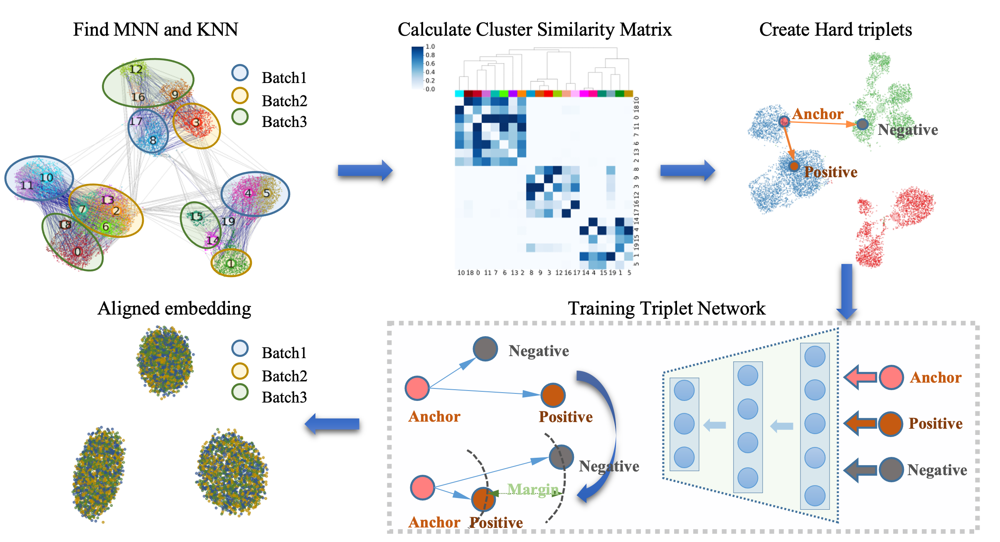
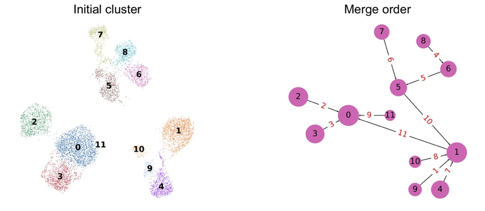
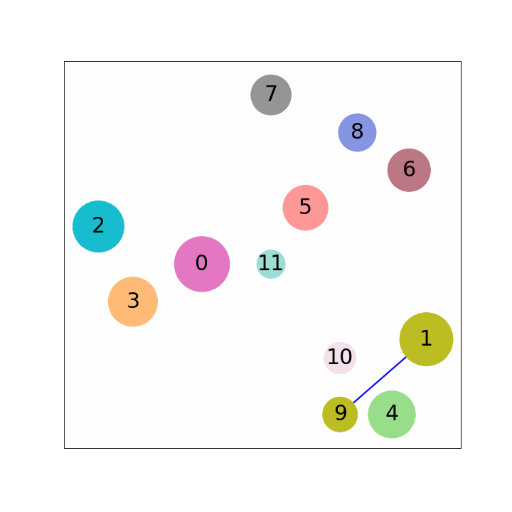

# scDML

## Overview

scDML (Batch Alignment of **s**ingle **c**ell transcriptomics data using **D**eep **M**etric **L**earning) is designed for single cell transcriptomics data's clustering, which is a deep learning model based on [deep metric learning](https://kevinmusgrave.github.io/pytorch-metric-learning) to remove batch effect, guided by the initial clusters and MNN information intra and inter batches. In this manuscript, we proposed a strategy to merge initial clusters successively that takes batch effect into consideration, by computing the number of KNN pairs intra batch and MNN pairs inter batches, then calculating the similarity of clusters, and finally constructing a hierarchical tree, in which the root of the tree is the unique cluster obtained after gathering all clusters, and the leaves are the clusters to be merged. Thereafter, we used the above MNNs to guide information for building better low-dimensional embeddings. In this way, this procedure guarantees that scDML outperforms existing methods in terms of merging the same cell types, separating different cell types and preserving cell types unique to some batches. To find code to reproduce the results we generated in that paper, please visit this separate github repository (https://github.com/eleozzr/scDML_reproduce), which provides all code (including that for other methods) necessary to reproduce our results. 




## Merge rule

scDML presents a novel merge rule to reassign cluster labels, which is important for scDML. Below figures illustrates that how to merge clusters hierarchically





## Usage

The following notebooks show you how to run scDML  

1. [tutorial1](./tutorial/tutorial1.ipynb) gives a detailed description in each step of scDML  
2. [tutorial2](./tutorial/tutorial2.ipynb) provides a simple running example. 

## Intallation

### Step1 

1. Install [Anaconda](https://www.anaconda.com/products/individual) if you do not have it.
2. Create a conda environment with python, and then activate it as follows in terminal. we have test two environment on linux

environment 1
```bash
conda create -n scDML python==3.8.12
conda activate scDML
```
environment 2
```bash
conda create -n scDML python==3.6.10
conda activate scDML
```


### Step2

1. Install directly from Github using pip:
```bash 
pip install git+https://github.com/eleozzr/scDML.git
```

2. Download the package from Github and install it locally:

```bash
git clone https://github.com/eleozzr/scDML
cd scDML
python setup.py install --user #or pip install 
```
or 
```bash
git clone https://github.com/eleozzr/scDML
cd scDML
python setup.py build
python setup.py install
```

or 
```bash
git clone https://github.com/eleozzr/scDML
cd scDML
pip install .
```

### Step3 (optional)

Run jupyter notebook under `scDML` environment

```bash
conda activate scDML
pip install jupyter
python -m ipykernel install --user --name scDML --display-name "Python_scDML" 
jupyter notebook
```

## Software Requirements for environment 2

```bash
numba==0.51.2
numexpr==2.7.1
numpy==1.18.1 
numpy-groupies==0.9.14
anndata==0.7.6
tables==3.6.1
scanpy==1.7.2
umap-learn==0.4.6
python-igraph==0.8.2
louvain==0.7.0
plotly==5.2.2
hnswlib==0.5.2
annoy==1.17.0
networkx==2.5
ipykernel==5.5.6
nbformat==5.1.3
pytorch-metric-learning==0.9.95
torch>=1.10.1
```

## Citation
Yu, X., Xu, X., Zhang, J. et al. Batch alignment of single-cell transcriptomics data using deep metric learning. Nat Commun 14, 960 (2023). https://doi.org/10.1038/s41467-023-36635-5
